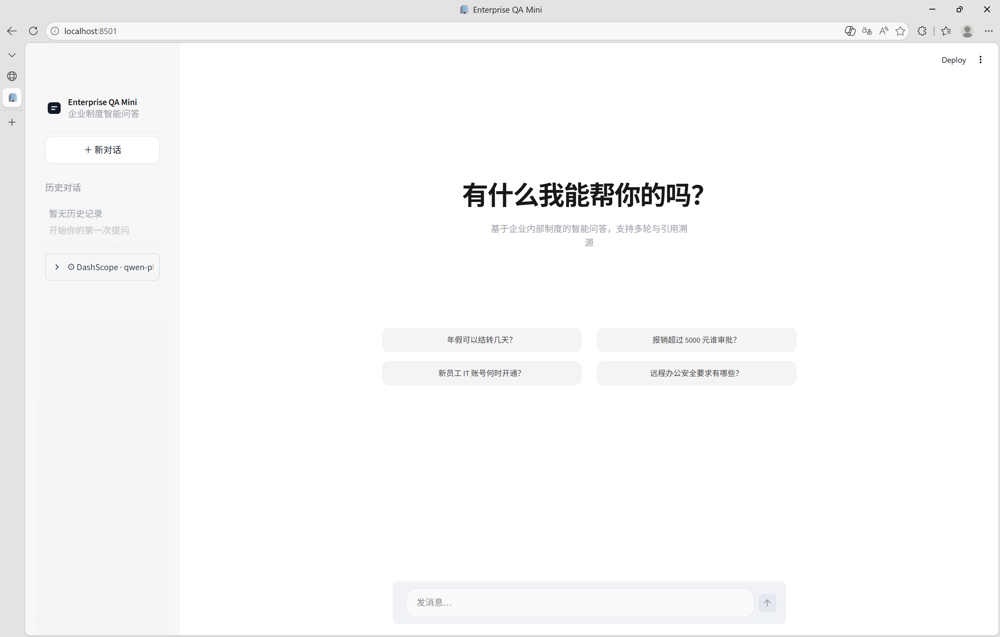
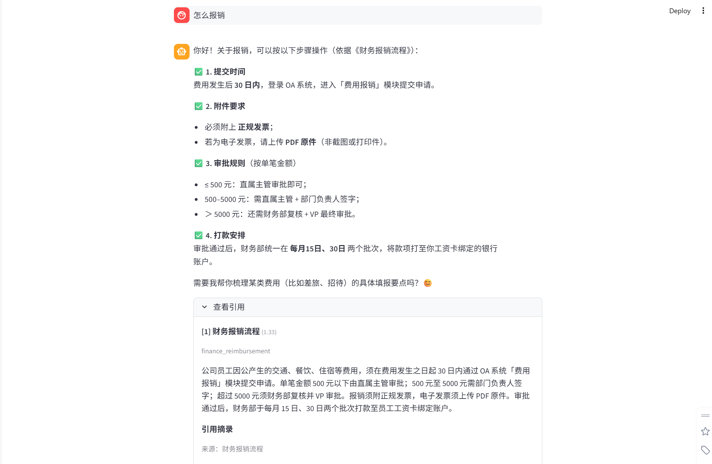
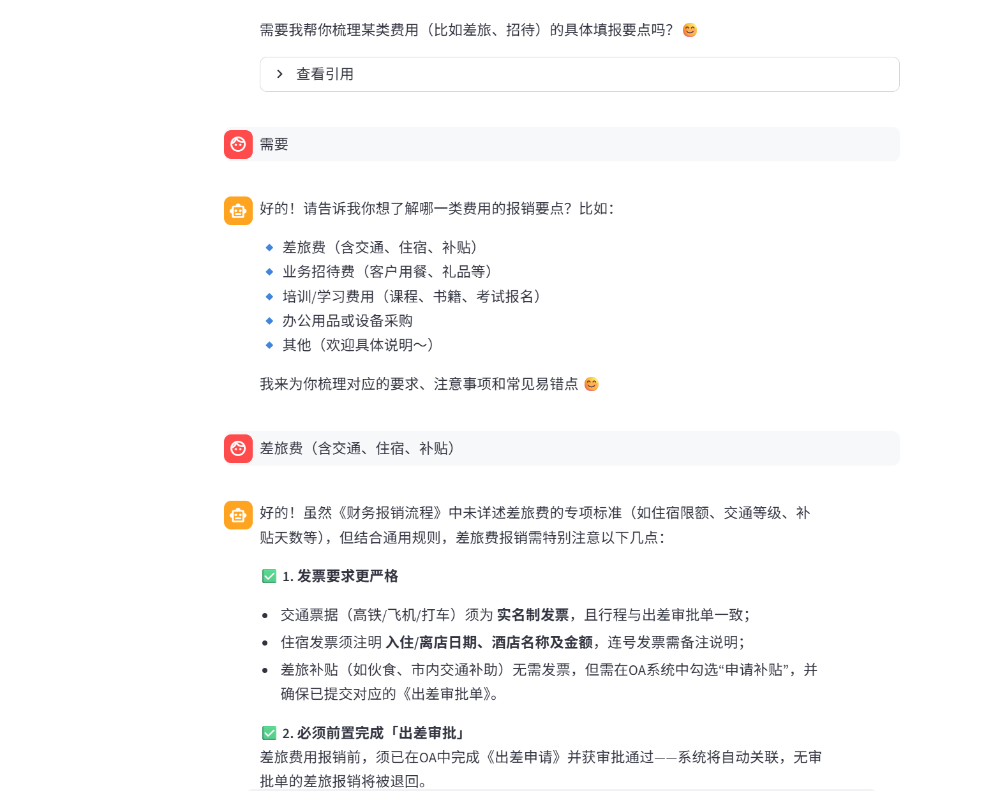
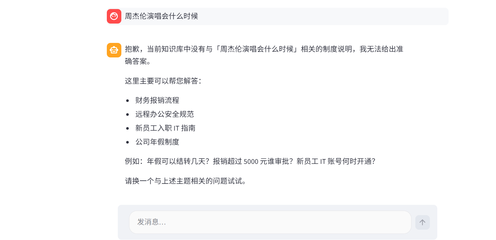
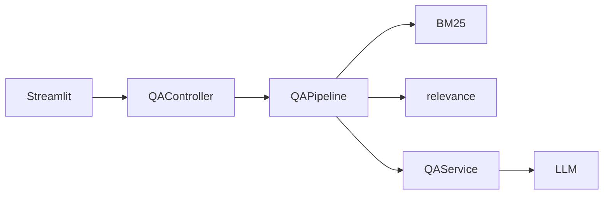

# Enterprise QA Mini

[](https://www.python.org/)
[](https://streamlit.io/)
[](LICENSE)

基于 Python 与 Streamlit 的**企业制度 RAG 问答**应用：检索增强生成、流式对话、引用溯源与多轮上下文管理。采用分层与接口化设计，支持 Mock 免 Key 本地演示。

---

## 功能特性

| 能力 | 说明 |
|------|------|
| RAG 问答 | BM25 + jieba 检索，结合制度片段生成受限回答 |
| 流式输出 | 助手回复通过 `st.write_stream` 逐字渲染 |
| 单次模型调用 | 每条用户问题仅一次核心 LLM 请求；引用区为原文摘录 |
| 多轮对话 | 会话历史传入模型；寒暄/承接语可跳过检索 |
| 引用溯源 | 展示命中片段、相关度与摘录内容 |
| 多会话 | 侧栏新建对话、历史切换 |
| 多后端 | Mock、DashScope、DeepSeek、OpenAI 兼容、Ollama |

## 技术栈

- **应用层**：Streamlit
- **检索**：rank-bm25、jieba
- **模型接入**：OpenAI 兼容 SDK（`openai`）
- **配置与契约**：pydantic、pydantic-settings、python-dotenv

---

## 快速开始

**环境要求**：Python 3.10+

```bash
git clone https://github.com/NEXTsimp/enterprise-qa-mini.git
cd enterprise-qa-mini
python -m venv .venv
```

| 系统 | 命令 |
|------|------|
| **Windows** | `.venv\Scripts\activate` → `pip install -r requirements.txt` → `copy .env.example .env` → `streamlit run app.py` |
| **macOS / Linux** | `source .venv/bin/activate` → `pip install -r requirements.txt` → `cp .env.example .env` → `streamlit run app.py` |

浏览器打开终端提示地址（通常 `http://localhost:8501`）。

**无 API Key**：`.env` 中设置 `LLM_PROVIDER=mock` 即可演示全流程。

配置项详见 [.env.example](.env.example) 与下文「配置说明」。

---

## 关键文件说明

| 路径 | 职责 |
|------|------|
| [`app.py`](app.py) | Streamlit 入口；会话状态、流式 UI、调用 Controller |
| [`controllers/qa_controller.py`](controllers/qa_controller.py) | UI 唯一业务入口：`prepare` / `stream_answer` / `ask` |
| [`orchestration/pipeline.py`](orchestration/pipeline.py) | RAG 编排：检索 → 相关性过滤 → 单次 LLM 问答 |
| [`core/services/qa_service.py`](core/services/qa_service.py) | 拼装 Prompt、多轮/兜底路由 |
| [`core/retrieval/relevance.py`](core/retrieval/relevance.py) | 闲聊/承接跳过检索、引用相关性过滤 |
| [`core/retrievers/bm25_retriever.py`](core/retrievers/bm25_retriever.py) | BM25 检索实现 |
| [`core/llm/factory.py`](core/llm/factory.py) | 按 `.env` 创建 Mock / OpenAI 兼容 / Ollama |
| [`core/services/citation_preview.py`](core/services/citation_preview.py) | 引用区原文摘录（不调 LLM） |
| [`ui/conversation_store.py`](ui/conversation_store.py) | 多会话存储、`messages` → `LLMMessage` 历史 |
| [`config/prompts.py`](config/prompts.py) | 制度问答 / 多轮对话 System Prompt |
| [`data/mock_docs.py`](data/mock_docs.py) | 内置 4 份制度 Mock 文档 |

**一次提问的数据流**：`app.py` → `QAController.prepare`（检索 + 构建 `PreparedQuery`）→ `stream_answer`（`chat_stream`）→ 写入 `session_state.messages`。

---

## 演示素材

素材位于 [`docs/screenshots/`](docs/screenshots/)，清单见 [docs/screenshots/README.md](docs/screenshots/README.md)。

### 录屏（约 3～5 分钟）

建议覆盖：**环境准备 → Mock 启动 → 制度问答 + 展开引用 → 多轮「需要」→ 新建对话**。

> **说明**：完整 `.mp4` 体积较大，**不纳入 Git 仓库**（见 `.gitignore`）。任选其一提交作业即可：
>
> 1. **外链录屏**（推荐）：上传至 B 站 / 飞书 / 网盘后，将链接填到下方  
> 2. **GIF**：本地导出 `docs/screenshots/demo-streaming.gif`（建议 ≤ 15MB）并提交  
> 3. **截图串联**：用下方「关键运行截图」+ 三个测试样例截图代替录屏

**演示视频（外链，请自行填写）**：（待补充，例如 `https://www.bilibili.com/video/...`）

本地录屏文件可放在 `docs/screenshots/demo-streaming.mp4`，仅本地演示用，勿 `git add`。

### 关键运行截图



### 问答 / 引用测试样例

**样例 1 — 制度 RAG + 引用溯源**

| 项 | 内容 |
|----|------|
| 输入 | `怎么报销？` |
| 预期 | 流式回答；展开「查看引用」可见制度标题、相关度、原文摘录 |
| 截图 |  |

**样例 2 — 多轮承接（不误触发「未找到制度」）**

| 项 | 内容 |
|----|------|
| 步骤 | 先问 `怎么报销？`，助手回复后输入 `需要` |
| 预期 | 结合上一轮上下文继续说明；**不**走「未找到相关制度」兜底 |
| 截图 |  |

**样例 3 — 无关问题**

| 项 | 内容 |
|----|------|
| 输入 | `周杰伦演唱会什么时候？` |
| 预期 | 不强行命中制度；返回未命中/友好兜底 |
| 截图 |  |

---

## AI 协作说明

本项目在开发过程中使用 **Cursor（Composer / Agent）** 辅助完成，人机分工大致如下：

| 环节 | 人工 | AI 辅助 |
|------|------|---------|
| 需求与架构 | 确定 RAG 单次调用、流式 UI、多轮路由等产品取舍 | 提供分层目录与接口拆分建议 |
| 实现 | 审核关键 Prompt、相关性阈值、UI 交互 | 生成/重构 `pipeline`、`qa_service`、Streamlit 聊天页 |
| 排错 | 确认现象、验收修复 | 根据报错堆栈定位缺失模块、编码与布局问题 |
| 文档 | 定稿 README 结构与面试表述 | 起草文档，人工删减半成品表述 |

**使用原则**：业务规则以代码与 Prompt 为准人工确认；AI 生成代码经本地运行与样例对话验证后再提交。

**未交由 AI 自动完成的部分**：真实 API Key 管理、生产部署、向量库上线。

---

## 排错记录

### 问题：`git push` 失败 `Failed to connect to github.com port 443`

| 项 | 说明 |
|----|------|
| **现象** | 本地 `git commit` 成功，`git push` 超时或 `Connection was reset` |
| **原因** | 当前网络无法稳定访问 `github.com:443` |
| **处理** | 配置代理（如 `git config --global http.proxy http://127.0.0.1:7890`）或更换网络后重试 |
| **验证** | `git push origin main` 成功 |

### 问题：`git push` 提示 `fetch first`（远程有本地没有的提交）

| 项 | 说明 |
|----|------|
| **现象** | `Updates were rejected because the remote contains work that you do not have locally` |
| **原因** | 在 GitHub 网页或其他端改过 README，与本地分支分叉 |
| **处理** | `git pull --rebase origin main`，解决冲突后 `git rebase --continue`，再 `git push origin main` |
| **验证** | 本地与远程 `main` 一致，网页可见最新 README 与截图 |

### 问题：启动或 `pytest` 报错 `future feature annotations is not defined`

| 项 | 说明 |
|----|------|
| **现象** | `import` 或 `pytest` 时在 `from __future__ import annotations` 处 `SyntaxError` |
| **原因** | 系统默认 `python` 版本低于 3.10（如 Anaconda 3.6） |
| **处理** | `py -3.11 -m venv .venv` 后激活，确认 `python --version` ≥ 3.10，再安装依赖 |
| **验证** | `pytest tests/ -q` 通过 |

---

## 架构概览

```text
app.py → controllers → orchestration/pipeline
         → retriever + relevance + qa_service + llm
         → domain (Pydantic)
```



| 设计原则 | 落地方式 |
|----------|----------|
| UI 与业务解耦 | `app.py` 仅依赖 `controllers`、`ui` |
| 接口驱动 | `AbstractRetriever` / `AbstractLLMService` + Factory |
| 配置外置 | `.env` + `config/settings.py` |

## 检索方案

默认 **BM25 + jieba**，面向内置 4 份短文档，毫秒级响应、无需向量库。扩展向量检索时可实现 `AbstractRetriever` 并在 `core/retrievers/factory.py` 注册。

## 配置说明

| 变量 | 含义 | 示例 |
|------|------|------|
| `LLM_PROVIDER` | 模型提供商 | `mock` / `dashscope` / `deepseek` |
| `LLM_API_KEY` | API 密钥 | Mock 可留空 |
| `LLM_MODEL` | 模型名 | `qwen-plus` |
| `RETRIEVER_BACKEND` | 检索后端 | `bm25` |

修改 `.env` 后需**重启** `streamlit run app.py`。

## 测试

```bash
pytest tests/ -q
```

## 许可证

[MIT License](LICENSE)
