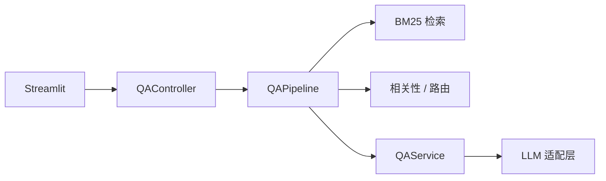

# Enterprise QA Mini

[](https://www.python.org/)
[](https://streamlit.io/)
[](LICENSE)

基于 Python 与 Streamlit 的**企业制度 RAG 问答**应用：检索增强生成、流式对话、引用溯源与多轮上下文管理。采用分层与接口化设计，支持本地 Mock 演示，可作为 LLM 应用工程方向的作品集项目。

---

## 功能特性

| 能力 | 说明 |
|------|------|
| RAG 问答 | BM25 + jieba 检索，结合制度片段生成受限回答 |
| 流式输出 | 助手回复通过 `st.write_stream` 逐字渲染 |
| 单次模型调用 | 每条用户问题仅一次核心 LLM 请求；引用区为原文摘录，无二次摘要调用 |
| 多轮对话 | 会话历史完整传入模型；寒暄与承接语（如「需要」「谢谢」）可跳过检索 |
| 引用溯源 | 展示命中片段、相关度与摘录内容 |
| 多会话 | 侧栏支持新建对话与历史切换 |
| 多后端 | Mock（免 Key）、DashScope、DeepSeek、OpenAI 兼容 API、本地 Ollama |

## 技术栈

- **应用层**：Streamlit
- **检索**：rank-bm25、jieba
- **模型接入**：OpenAI 兼容 SDK（`openai`）
- **配置与模型**：pydantic、pydantic-settings、python-dotenv

## 架构概览

```text
app.py                      # 入口：薄 UI，仅调用 Controller
├── ui/                     # 界面组件、侧栏、会话状态
├── controllers/            # QAController
├── orchestration/          # QAPipeline（检索 → 准备上下文 → 流式问答）
├── core/
│   ├── interfaces/         # AbstractRetriever、AbstractLLMService
│   ├── retrievers/         # BM25Retriever、factory
│   ├── llm/                # OpenAI 兼容 / Mock / Local
│   ├── retrieval/          # 相关性过滤、多轮路由
│   └── services/           # QAService、引用摘录、兜底回复
├── domain/                 # QueryRequest、QueryResult、PreparedQuery
├── config/                 # 环境配置、Prompt 模板
└── data/                   # 内置 Mock 制度文档
```



| 设计原则 | 落地方式 |
|----------|----------|
| UI 与业务解耦 | `app.py` 仅依赖 `controllers` 与 `ui` |
| 接口驱动 | 检索器、LLM 通过抽象接口与工厂切换实现 |
| 类型安全 | 请求/响应使用 Pydantic 模型贯穿流水线 |
| 配置外置 | `.env` + `config/settings.py` |

## 快速开始

**环境要求**：Python 3.10 及以上。

```bash
git clone https://github.com/NEXTsimp/enterprise-qa-mini.git
cd enterprise-qa-mini

python -m venv .venv
```

**Windows**

```powershell
.venv\Scripts\activate
pip install -r requirements.txt
copy .env.example .env
streamlit run app.py
```

**macOS / Linux**

```bash
source .venv/bin/activate
pip install -r requirements.txt
cp .env.example .env
streamlit run app.py
```

启动后在浏览器访问终端提示的地址（通常为 `http://localhost:8501`）。

## 配置说明

完整变量见 [.env.example](.env.example)。常用项如下：

| 变量 | 含义 | 示例 |
|------|------|------|
| `LLM_PROVIDER` | 模型提供商 | `mock`、`dashscope`、`deepseek`、`openai`、`local` |
| `LLM_API_KEY` | API 密钥（Mock 可留空） | `sk-...` |
| `LLM_MODEL` | 模型名称 | `qwen-plus` |
| `RETRIEVER_BACKEND` | 检索后端（当前仅 `bm25`） | `bm25` |
| `RETRIEVAL_TOP_K_DEFAULT` | 默认返回片段数 | `1` |

**无 API Key 演示（推荐）**

```env
LLM_PROVIDER=mock
```

**通义千问示例**

```env
LLM_PROVIDER=dashscope
LLM_API_KEY=你的密钥
LLM_MODEL=qwen-plus
```

修改 `.env` 后需重启 Streamlit 进程。

## 检索方案

默认使用 **BM25 + jieba**，面向项目内置的 4 份短文档，具备毫秒级响应且无需向量数据库。若需扩展为向量检索，可实现 `AbstractRetriever` 子类并在 `core/retrievers/factory.py` 中注册。

## 测试

```bash
pytest tests/ -q
```

## 许可证

本项目采用 [MIT License](LICENSE)。
